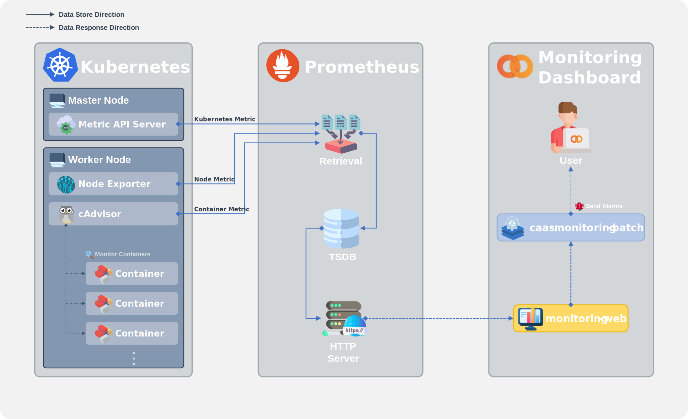
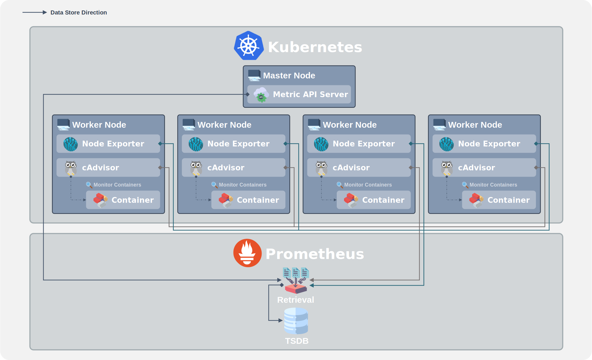

### [Index](https://github.com/PaaS-TA/Guide) > [Monitoring Architecture](PAAS-TA_MONITORING_ARCHITECTURE.md) > CaaS

# CaaS Monitoring Architecture

### │ CaaS Monitoring Architecture
CaaS 환경의 구조를 살펴보면 크게 K8S 클러스터 레이어, K8S의 파드 및 컨테이너 서비스의 모니터링에 특화된 Prometheus 레이어, 그리고 전술한 레이어들과의 통신을 통해 모니터링 정보를 가져와 시각화하거나 사용자 알람을 기능을 위한 Batch 모듈 등이 동작하고 있는 Monitoring Dashboard 레이어로 구성되어 있다.  
각 Batch 모듈은 Monitoring Portal(Web UI)에서 등록한 임계치 정보를 기준으로 각 서비스별 모니터링 대상에 대해 주기적으로 시스템 메트릭 정보를 조회하고 분석한다. 이때 임계치를 초과한 서비스 발견시 관리자에게 알람을 전송한다.  
Monitoring Portal(Web UI)에서는 K8S를 모니터링하고 있는 Prometheus와의 통신(HTTP API)을 통해 메트릭 데이터를 조회하고 조회된 데이터를 바탕으로 CaaS 영역의 모니터링 정보를 시각화한다. 이를 기반으로 알람이 발생된 이벤트 현황을 조회하고 K8S 파드 및 컨테이너 상태와 장애 발생 서비스에 대한 통계 정보를 조회할 수 있다. 또한 이벤트에 대한 처리 이력 등을 관리할 수 있는 화면도 제공한다.

### │ CaaS Collecting Metric Data Architecture
CaaS 환경의 모니터링은 메트릭 정보를 수집하는 Agent로 기본적으로 Node Exporter, cAdvisor가 사용된다. 해당 Agent의 데이터는 Prometheus의 Retrieval 컴포넌트를 통해 수집된 후 다시 TSDB(Time Series Database)에 저장된다. 이렇게 저장된 모니터링 데이터는 Prometheus의 HTTP Server를 통해 PromQL을 사용하여 조회할 수 있다.

### [Index](https://github.com/PaaS-TA/Guide) > [Monitoring Architecture](PAAS-TA_MONITORING_ARCHITECTURE.md) > CaaS
