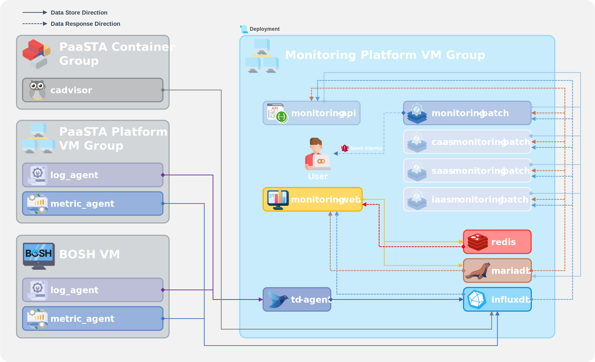
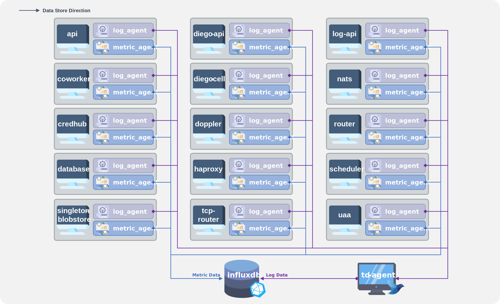

### [Index](https://github.com/PaaS-TA/Guide) > [Monitoring Architecture](PAAS-TA_MONITORING_ARCHITECTURE.md) > PaaS

# PaaS Monitoring Architecture

### │ PaaS Monitoring Architecture
PaaS-TA Monitoring 배포가 완료된 후의 구조를 살펴보면 크게 백엔드 영역의 Batch 모듈과 데이터베이스, 프론트엔드 영역의 Web UI(Portal), API 등으로 이루어져 있다.  
각 Batch 모듈은 Monitoring Portal(Web UI)에서 등록한 임계치 정보를 기준으로 각 서비스별 모니터링 대상에 대해 주기적으로 시스템 메트릭 정보를 조회하고 분석한다. 이때 임계치를 초과한 서비스 발견시 관리자에게 알람을 전송하며 임계치를 초과한 컨테이너 리스트 중에서 오토스케일 대상의 컨테이너가 존재할 경우 오토스케일 수행 서버에 해당 정보를 전송하여 오토스케일 기능이 수행되도록 한다.  
PaaS 환경의 메트릭 데이터 또는 로그 데이터를 저장하기 위한 시계열 데이터베이스 소프트웨어로 현재 InfluxDB가 사용되고 있다. 이 InfluxDB에 담긴 데이터의 조회를 위해 각각의 미들웨어 또는 Batch 모듈은 InfluxDB에 접근하여 데이터를 조회하는 방식으로 개발되었고 GO 언어로 작성되었다.  
Monitoring API에서는 각 클라우드 서비스 모델별 특성에 따른 여러가지 기능과 이를 사용할 수 있는 통합 인터페이스를 제공한다. 또한 Swagger 라이브러리를 도입하여 API 문서의 관리 및 유지보수의 용이성을 높임과 동시에 API 유저 가이드 역할도 수행할 수 있도록 하였다.  
Monitoring Portal(Web UI)에서는 알람이 발생된 이벤트 현황을 조회하고 PaaS-TA VM 및 컨테이너 상태와 장애 발생 서비스에 대한 통계 정보를 조회할 수 있다. 또한 이벤트에 대한 처리 이력 등을 관리할 수 있는 화면도 제공한다.  

### │ PaaS Collecting Metric Data Architecture
PaaS 환경을 구성하는 요소의 내부를 살펴보면 크게 메트릭 데이터를 담당하는 metric_agent 또는 cadvisor, 그리고 로그 데이터를 담당하는 log_agent(syslog)를 통해서 수집되는 데이터가 주요한 원천 기반이 되고 있으며, 여기에 배포된 PaaS-TA Monitoring 플랫폼의 각 구성 요소들을 통해 처리, 집계, 가공, 저장 등의 과정을 거쳐 사용자에게 필요한 정보화가 이루어지게 된다.  
먼저 metric_agent는 시스템 리소스 또는 메트릭 정보를 수집하여 InfluxDB에 데이터를 전달하는 역할을 한다. 다음으로 log_agent(syslog)는 먼저 로그 데이터의 수집, 파싱, 중계 역할을 담당하는 td-agent(fluentd)로 데이터를 전송하고 이후 td-agent(fluentd)가 데이터베이스로 데이터를 중계하여 최종적으로 InfluxDB에 로그 데이터가 저장되게 된다. 과거에는 로그 데이터를 저장하기 위해 ELK Stack과 이를 구성하기 위해서 'logsearch'라는 이름의 배포 스크립트를 별도로 사용해야 했으나 현재는 공식적으로 지원이 중단되었고 td-agent(fluentd)로 대체되었다.

### [Index](https://github.com/PaaS-TA/Guide) > [Monitoring Architecture](PAAS-TA_MONITORING_ARCHITECTURE.md) > PaaS
