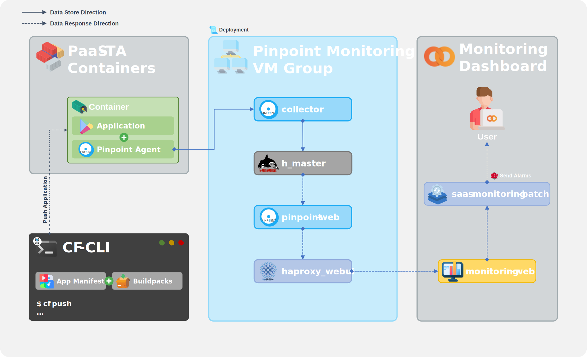
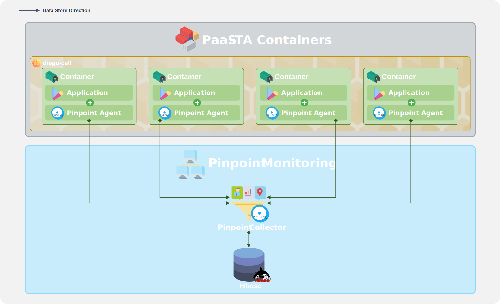

### [Index](https://github.com/PaaS-TA/Guide) > [Monitoring Architecture](PAAS-TA_MONITORING_ARCHITECTURE.md) > SaaS

# SaaS Monitoring Architecture

### │ SaaS Monitoring Architecture
SaaS 환경의 구조를 살펴보면 크게 PaaS-TA Containers 레이어, APM(Application Performance Managerment)을 위해 CF for VMs 기반으로 구성한 Pinpoint Monitoring 레이어, 그리고 전술한 레이어들과의 통신을 통해 모니터링 정보를 가져와 시각화하거나 사용자 알람을 기능을 위한 Batch 모듈 등이 동작하고 있는 Monitoring Dashboard 레이어로 구성되어 있다.  
각 Batch 모듈은 Monitoring Portal(Web UI)에서 등록한 임계치 정보를 기준으로 각 서비스별 모니터링 대상에 대해 주기적으로 시스템 메트릭 정보를 조회하고 분석한다. 이때 임계치를 초과한 서비스 발견시 관리자에게 알람을 전송한다.  
Monitoring Portal(Web UI)에서는 Pinpoint의 APM Server를 통해서 모니터링 데이터를 조회하고 조회된 데이터를 바탕으로 SaaS 영역의 모니터링 정보를 시각화한다. 이를 기반으로 알람이 발생된 이벤트 현황을 조회하고 서비스 중인 애플리케이션 관한 통계 정보를 조회할 수 있다. 또한 이벤트에 대한 처리 이력 등을 관리할 수 있는 화면도 제공한다.

### │ SaaS Collecting Metric Data Architecture
SaaS 환경의 모니터링은 메트릭 정보를 수집하는 Agent로 Pinpoint Agent가 사용된다. Pinpoint Agent는 CF 상에 배포되는 애플리케이션에 빌드팩으로 지정하여 함께 사용할 수 있다. 이때 Pinpoin Agent는 애플리케이션 관련 메트릭 정보를 수집하게 되고 수집된 데이터는 다시 Pinpoint Collect에서 처리, 집계, 가공된 후 Hbase에 저장된다. 이렇게 저장된 모니터링 데이터는 Pinpoint Web(API)을 통하여 조회할 수 있다.

### [Index](https://github.com/PaaS-TA/Guide) > [Monitoring Architecture](PAAS-TA_MONITORING_ARCHITECTURE.md) > SaaS
