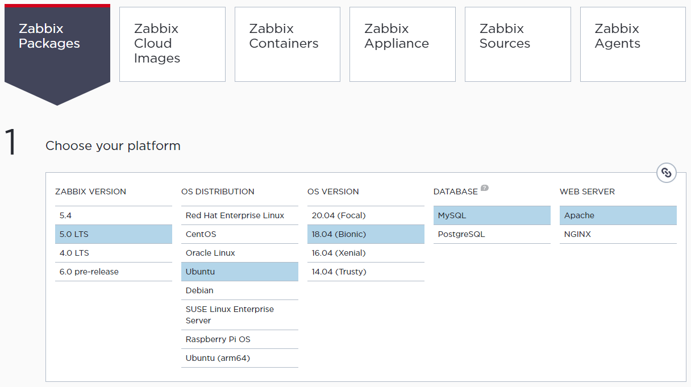

### [Index](https://github.com/PaaS-TA/Guide/tree/working-new-template) > [Monitoring Install](PAAS-TA_MONITORING_INSTALL_GUIDE.md) > Zabbix Agent


# Zabbix Agent Install Guide
1. [개요](#1)
2. [Zabbix Agent의 설치](#2)


## <div id="1">1. 개요


### 1.1. 소개
본 문서는 사용자의 IaaS 환경 시스템 자원 정보를 수집하여 실시간 컴퓨팅 자원의 사용량 또는 유휴 자원량을 측정해 PaaS-TA 플랫폼에서 사용 가능한 모니터링 대시보드와 연계하기 위한 Zabbix Agent 설치 및 환경 설정 방법에 대한 설명을 다루고 있다.
  

### 1.2. 범위와 한계
또한 본 가이드는 다음과 같은 설치 환경을 바탕으로 작성되었으므로 가이드에서 언급되지 않은 기타 범위에 대하여는 일부 제약이나 설치 또는 적용에 한계가 있을 수 있다.

<table>
  <tr>
    <td><b>Virtual Machine OS</b></td>
    <td>[AP] Ubuntu 16.04.7 LTS (Xenial)<br>
        [CP] Ubuntu 18.04.6 LTS (Bionic)</td>
  </tr>
  <tr>
    <td><b>IaaS Vendor SW</b></td>
    <td> OpenStack 5.4.0 (Stein)
    </td>
  </tr>
</table>


## <div id="2">2. Zabbix Agent의 설치


### 2.1. 서비스 플랫폼에 따른 Zabbix Agent 설치
**│ Application Platform (AP)**  

AP 환경에서 Zabbix Agent는 PaaS-TA 플랫폼 배포와 함께 PaaS-TA 환경을 구성하는 각 인스턴스에 내장 설치된다. 따라서 AP 환경에서는 Zabbix Agent를 별도로 설치할 필요가 없다.

**│ Container Platform (CP)**  

AP 환경에서 배포 자동화 스크립트를 이용해 플랫폼을 배포했던 방식과는 달리 CP 환경에서는 쿠버네티스를 사용해 클러스터링을 구현할 노드의 수를 결정하거나 혹은 IaaS 플랫폼에서 가상 머신을 생성하거나 하는 일련의 작업이 수동으로 이루어지게 된다. 따라서 CP 환경을 구성하는 각 노드에 Zabbix Agent를 별도로 설치하는 작업이 필요하다.

Zabbix 공식 홈페이지를 방문하면 [다운로드 페이지](https://www.zabbix.com/download)를 통해 설치하고자 하는 Zabbix 버전, 운영체제 종류와 버전 등을 선택하여 사용자의 운영 환경에 알맞는 설치 스크립트를 제공 받을 수 있다.



**Zabbix Packages**는 Zabbix Server와 Zabbix Agent 설치 구성을 의미한다. 이 단계에서 Zabbix Server는 설치할 필요가 없으므로 Server 설치와 관련된 스크립트는 생략하고 Zabbix Agent 설치 스크립트만 따라 실행하도록 한다. 


### 2.2. Zabbix Agent 설치
Zabbix 저장소를 설치한다.
```
$ wget https://repo.zabbix.com/zabbix/5.0/ubuntu/pool/main/z/zabbix-release/zabbix-release_5.0-1+bionic_all.deb
$ sudo dpkg -i zabbix-release_5.0-1+bionic_all.deb
$ sudo apt update
```

Zabbix Agent를 설치한다.
```
$ sudo apt -y install zabbix-agent
```
Zabbix Agent를 위한 설정 파일(`/etc/zabbix/zabbix_agentd.conf`)을 편집한다.
```
...
Server=10.10.10.10
...
ServerActive=10.10.10.10:1005
...
Hostname=zabbix-agent1
...
Hostmetadata=paasta
...
```
> **[ 주요 설정 파라미터 ]**  
> . `Server`: Zabbix Server의 IP 주소를 입력한다.  
> . `ServerActive`: Zabbix Server의 IP 주소와 서비스 포트 번호를 콜론으로 연결하여 입력한다.  
> . `Hostname`: 호스트명을 입력한다. 이곳에 설정된 내용이 Zabbix Server의 모니터링 호스트명이 된다.  
> . `Hostmetadata`: 자동 모니터링 호스트 등록과 그룹핑을 위해 인스턴스 범위를 구분하기 위한 일종의 태그 같은 역할을 한다.

Zabbix Agent를 재시작한다.
```
$ sudo systemctl restart zabbix-agent
```

### [Index](https://github.com/PaaS-TA/Guide/tree/working-new-template) > [Monitoring Install](PAAS-TA_MONITORING_INSTALL_GUIDE.md) > Zabbix Agent