### [Index](https://github.com/PaaS-TA/Guide/tree/working-new-template) > [Monitoring Install](PAAS-TA_MONITORING_INSTALL_GUIDE.md) > Zabbix Server


# Zabbix Server Install Guide
1. [개요](#1)
2. [Zabbix Server의 설치](#2)
3. [PaaS-TA 플랫폼을 위한 필수 환경설정](#3)


## <div id="1">1. 개요


### 1.1. 소개
본 문서는 사용자의 IaaS 환경에 대한 시스템 자원 정보를 수집하여 실시간 컴퓨팅 자원의 사용량 또는 유휴 자원량을 측정해 PaaS-TA 플랫폼에서 사용 가능한 모니터링 대시보드와 연계하기 위한 Zabbix Server 설치 및 환경설정 방법에 대한 설명을 다루고 있다.
  

### 1.2. 범위와 한계
또한 본 가이드는 다음과 같은 설치 환경을 바탕으로 작성되었으므로 가이드에서 언급되지 않은 기타 범위에 대하여는 일부 제약이나 설치 또는 적용에 한계가 있을 수 있다.

<table>
  <tr>
    <td><b>Physical Node OS</b></td>
    <td> CentOS Linux 7.8.2003</td>
  </tr>
  <tr>
    <td><b>IaaS Vendor SW</b></td>
    <td> OpenStack 5.4.0 (Stein)
    </td>
  </tr>
</table>


## <div id="2">2. Zabbix Server의 설치


### 2.1. 운영 환경 선택
Zabbix 공식 홈페이지를 방문하면 [다운로드](https://www.zabbix.com/download) 페이지를 통해 설치하고자 하는 Zabbix 버전, 운영체제 종류와 버전 등을 선택하여 사용자의 운영 환경에 알맞는 설치 스크립트를 제공 받을 수 있다.

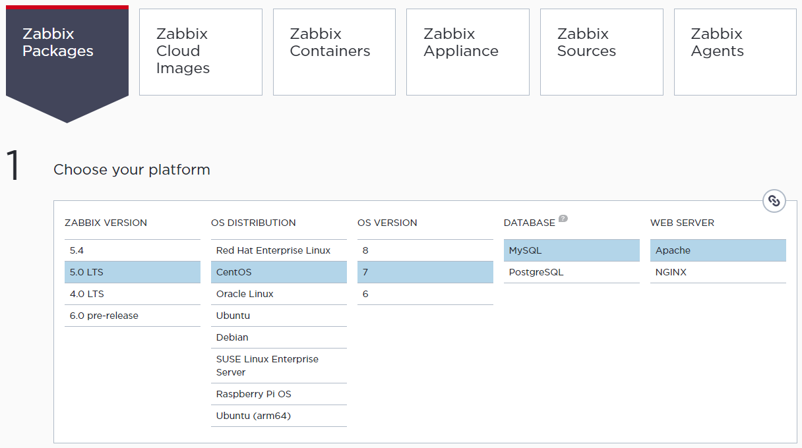

**Zabbix Packages** 탭에서 제공 받을 수 있는 설치 스크립트를 통해 Zabbix Server, Proxy, Agent 등 Zabbix 관련 패키지를 모두 설치할 수 있는 저장소 정보를 내려 받을 수 있다. Zabbix Server가 설치될 Physical Node 자체의 시스템 모니터링 역시 필요하므로 패키지 설치를 통해서 Zabbix Server와 Zabbix Agent를 함께 설치한다.

본 가이드에서는 CentOS 7 운영체제에서 Zabbix 5.0 LTS 버전의 Server 및 Agent, 데이터베이스 SW로는 MySQL, 웹 서버 SW로는 Apache 구성으로 선택해 설치하였다.


### 2.2. Zabbix Packages 설치
Zabbix 저장소를 설치한다.
```
# rpm -Uvh https://repo.zabbix.com/zabbix/5.0/rhel/7/x86_64/zabbix-release-5.0-1.el7.noarch.rpm
# yum clean all
```

Zabbix Server와 Zabbix Agent를설치한다.
```
# yum -y install zabbix-server-mysql zabbix-agent
```

Zabbix 프론트엔드 설치를 위해 Red Hat 소프트웨어 컬렉션을 설치한다.
```
# yum -y install centos-release-scl
```

Zabbix 프론트엔드 저장소를 활성화를 위해 `/etc/yum.repos.d/zabbix.repo` 파일을 다음과 같이 편집한다. 
```
...
[zabbix-frontend]
...
enabled=1
...
```

Zabbix 프론트엔드 패키지를 설치한다.
```
# yum -y install zabbix-web-mysql-scl zabbix-apache-conf-scl
```

서버의 데이터베이스가 작동(활성화) 상태인지 확인한 후 다음과 같이 데이터베이스 및 계정을 생성한 후 데이터베이스 명령 프롬프트에서 빠져나온다.
```
# mysql -uroot -p
Enter password: 
...
mysql> create database zabbix character set utf8 collate utf8_bin;
mysql> create user zabbix@localhost identified by 'paasta';
mysql> grant all privileges on zabbix.* to zabbix@localhost;
mysql> quit;
...
```

생성한 `zabbix` 데이터베이스에 다음과 같이 Zabbix 운영에 필요한 스키마와 데이터를 삽입한다. 이 때 앞서 생성한 계정의 비밀번호를 요구하므로 알맞은 비밀번호를 입력해준다(가이드에서는`paasta`로 설정하였다).
```
# zcat /usr/share/doc/zabbix-server-mysql*/create.sql.gz | mysql -uzabbix -p zabbix
Enter Password:
```

Zabbix Server의 데이터베이스 비밀번호를 `/etc/zabbix/zabbix_server.conf` 파일 내 `DBPassword` 항목을 찾아 다음과 같이 추가한다. 
```
...
DBPassword=paasta
...
HostMetadata=openstack
...
```

Zabbix 프론트엔드를 위한 PHP 설정 파일을 수정한다. `/etc/opt/rh/rh-php72/php-fpm.d/zabbix.conf` 파일 내 타임존 설정을 사용자 환경에 맞는 시각으로 변경한다. 만약 해당 항목에 `;` 기호가 있다면 제거한다.
```
...
php_value[date.timezone] = Asia/Seoul
...
```

Zabbix Server와 Agent 그리고 프론트엔드 관련 패키지들을 재시작한다.
```
# systemctl restart zabbix-server zabbix-agent httpd rh-php72-php-fpm
# systemctl enable zabbix-server zabbix-agent httpd rh-php72-php-fpm
```

이제 인터넷 브라우저를 통해 Zabbix 프론트엔드 설치 페이지로 접속할 수 있다. <b>'http://<i>{your_server_ip_or_name}</i>/zabbix'</b>로 접속해 각 단계별 안내에 따라 Zabbix 프론트엔드 설치를 완료한다.

**① Welcome** - 'Next step' 버튼으로 설치를 시작한다.

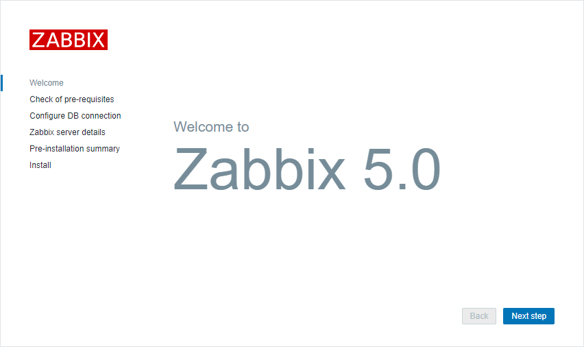

**② Check of pre-requisites** - 모든 항목에서 'OK' 상태가 되어야 한다.

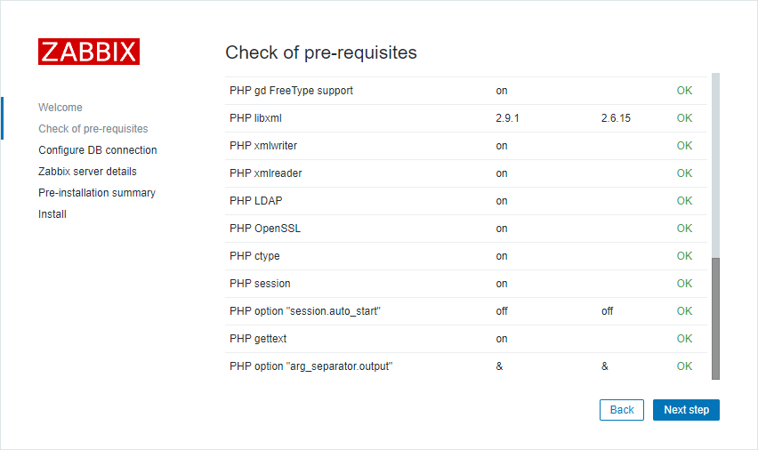

**③ Configure DB connection** - 본 가이드에서는 DB를 로컬 환경에서 사용하는 것으로 가정하였다. 해당 설정은 각 사용자의 설치 환경에 알맞게 설정한다.

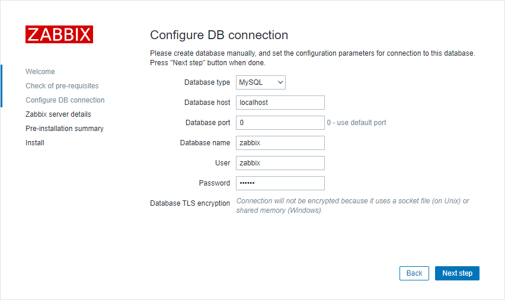

**④ Zabbix-server details** - 호스트명 정보 등을 입력한다. 포트 번호 정도만 정확하게 입력해 주고 나머지 값은 사용자가 임의로 설정하여 사용 가능하다.

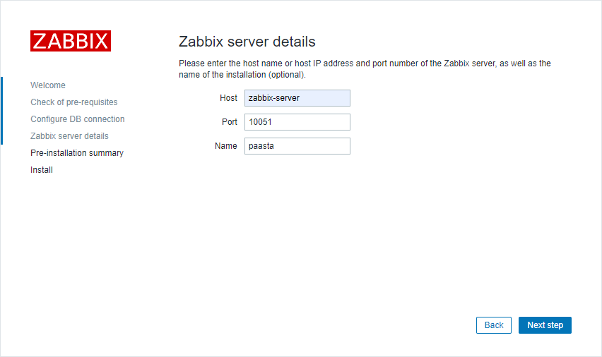

**⑤ Pre-installation summary** - 설치 요약 정보를 확인한다.

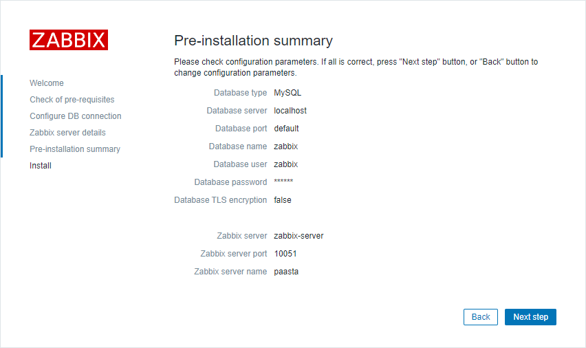

**⑥ Install** - 설치가 완료되었다.

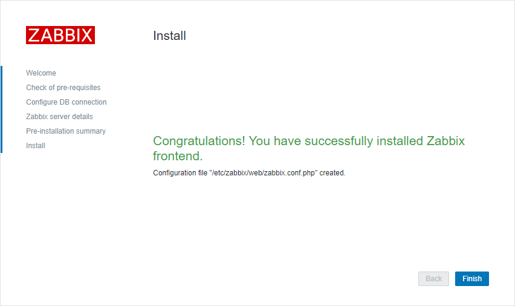

**⑦ Login** -  관리자 게정 정보를 사용하여 로그인한다(Username: Admin, Password: zabbix).

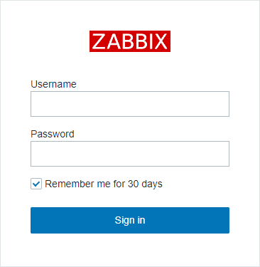

**⑧ Monitoring > Dashboard(Global view)** - 로그인에 성공하면 Global view 페이지를 볼 수 있다.

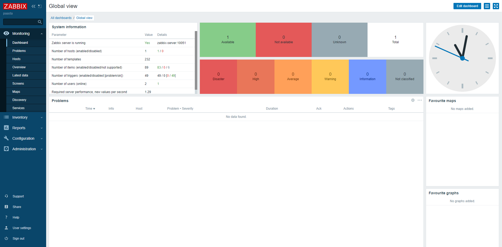

**⑨ Monitoring > Hosts** - Hosts 페이지로 이동해 로컬 환경에 설치된 Agent가 연결되었는지 확인한다('ZBX' 아이콘이 초록색으로 점등되면 연결된 것이다). Zabbix server가 설치된 로컬 환경의 Zabbix agent는 자동으로 연결된다.

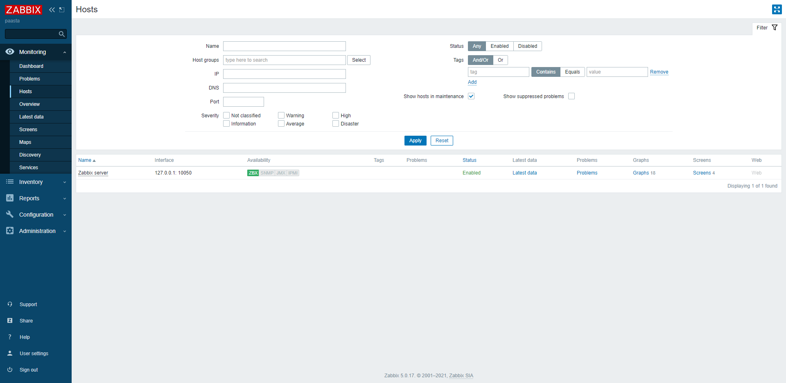


## <div id="3">3. PaaS-TA 플랫폼을 위한 필수 환경설정


### 3.1. Create host group(필수 호스트 그룹 생성)
PaaS-TA 플랫폼에서 IaaS 모니터링을 위해 필수 설정되어야 할 호스트 그룹 생성 방법에 대해 알아본다.

**Configuration > Host groups** 메뉴로 이동하면 우측 상단의 'Create host group' 버튼을 통해 모니터링 호스트 그룹을 생성할 수 있다.

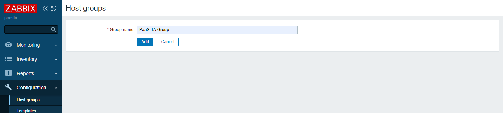

위와 같이 사용자 정의 호스트 그룹을 생성할 수 있으며, PaaS-TA 플랫폼의 IaaS 모니터링 환경에서 필수 설정되어야 할 호스트 그룹은 다음과 같다.

> **[ 필수 호스트 그룹 ]**   
. PaaS-TA Group  
. Openstack hypervisors

<table>
  <tr>
    <td >⚠️ PaaS-TA 플랫폼에서의 IaaS 모니터링은 필수 호스트 그룹 목록과 동일한 설정에서 정상 작동하도록 설계되었으므로 그룹을 생성할 때는 반드시 본 문서에 서술된 그대로 <b>대·소문자 및 띄어쓰기를 구별하여 가이드와 동일하게 그룹명을 작성</b>하는 것에 주의한다.</td>
  </tr>
</table>


### 3.2. Autoregistration actions(호스트 자동 등록)
PaaS-TA 플랫폼에서 IaaS 모니터링을 위해 필수 설정되어야 할 **'Autoregistration actions'** 옵션 설정 방법에 대해 알아본다. 앞서 생성한 필수 호스트 그룹에 따라 옵션이 다소 다르므로 다음 가이드에 안내된 내용을 참고한다.

**│ PaaS-TA Group**  

**Configuration > Actions** 메뉴로 이동해 좌측 상단의 드롭다운 메뉴 중 **'Autoregistration actions'** 설정 페이지로 이동한다.

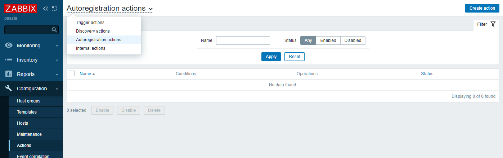

우측 상단에 'Create action' 버튼을 눌러 호스트를 자동 등록하기 위한 새로운 액션(규칙)을 만든다. 적당한 액션 이름(Name)을 임의 지정한 다음 'Condition'란의 'Add'를 통해 조건을 추가할 수 있다. 추가될 새로운 조건은 다음과 같이 지정하여 준다.

> **[ Action > Conditions > New condition ]**  
. Type: Host metadata  
. Operator: contains  
. Value: paasta

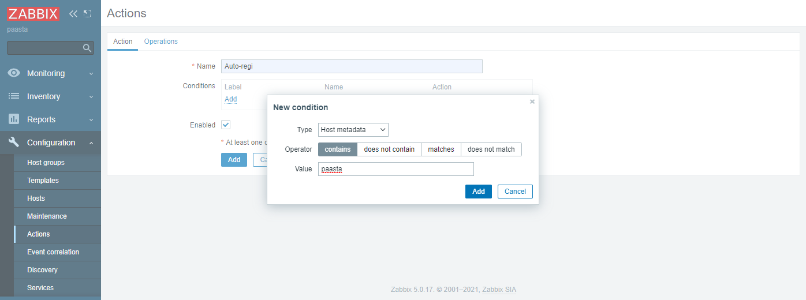

이 조건 설정을 통해 Zabbix Server는 네트워크 안에서 감지되는 수많은 호스트들 중에서 'Host metadata' 타입으로 'paasta'라는 문자열을 포함(contains)하고 있는 호스트들에 대해서만 구별하여 별도의 설정을 할 수 있다.

이제 'Operations' 탭으로 이동해 다음 설정을 추가한다.

> **[ Operations ]**  
. <b>Add host</b>  
. <b>Add to host groups:</b> PaaS-TA Group  
. <b>Link to templates:</b> Template OS Linux by Zabbix agent  
. <b>Enable host</b>

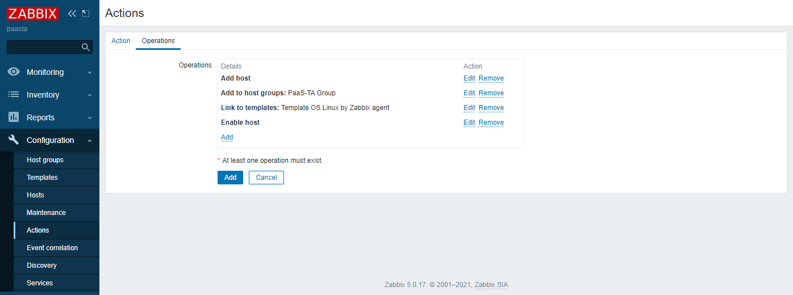

'Add' 버튼을 눌러 최종적으로 액션 설정을 추가한다. 이 액션 설정을 통해 Zabbix Server는 네트워크 안에서 감지되는 수많은 호스트들 중에서 'Host metadata' 타입으로 'paasta'라는 문자열을 포함(contains)하고 있는 호스트들에 대해서 'PaaS-TA Group'으로 그룹핑하여 모니터링 호스트로 자동 등록하게 된다.

**│ Openstack hypervisors** 

같은 방법으로 'Openstack hypervisors' 그룹에 대한 액션을 설정하되 설정 옵션은 다음을 참고한다.

> **[ Action > Conditions > New condition ]**  
. Type: Host metadata  
. Operator: contains  
. Value: openstack

> **[ Operations ]**  
. <b>Add host</b>  
. <b>Add to host groups:</b> Openstack hypervisors  
. <b>Link to templates:</b> Template OS Linux by Zabbix agent  
. <b>Enable host</b>


### 3.3. Create proxy(프록시 설정)
Zabbix Proxy가 설치된 노드(인스턴스) 정보를 Zabbix Server 프론트엔드를 통해 등록하는 방법에 대해 알아본다.
 
**Administration > Proxies** 메뉴로 이동해 우측 상단의 'Create proxy' 버튼을 통해 프록시 설정이 가능하다. Zabbix Proxy가 설치된 인스턴스에서 설정된 환경설정 값을 바탕으로 각 사용자 설정에 알맞게 Proxy 정보를 입력한 후 설정을 완료한다.

> **[ Proxy ]**  
. Proxy name: zabbix proxy 01  
. Proxy mode: Active  
. Proxy address: 11.11.11.11

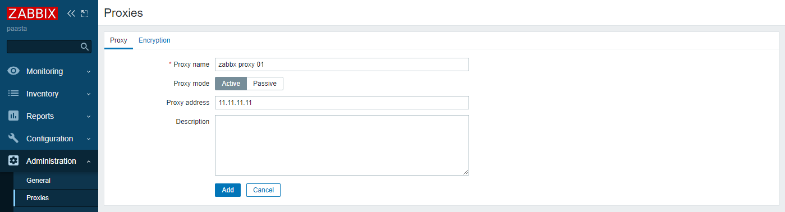

OpenStack 환경에서는 Proxy 인스턴스에 Floting IP를 할당함으로 가상 네트워크로 격리된 PaaS-TA 네트워크 간의 중계 역할을 하도록 설계되었으므로 'Proxy address'란에는 Proxy 인스턴스에 할당된 Floting IP를 설정한다.


### [Index](https://github.com/PaaS-TA/Guide/tree/working-new-template) > [Monitoring Install](PAAS-TA_MONITORING_INSTALL_GUIDE.md) > Zabbix Server