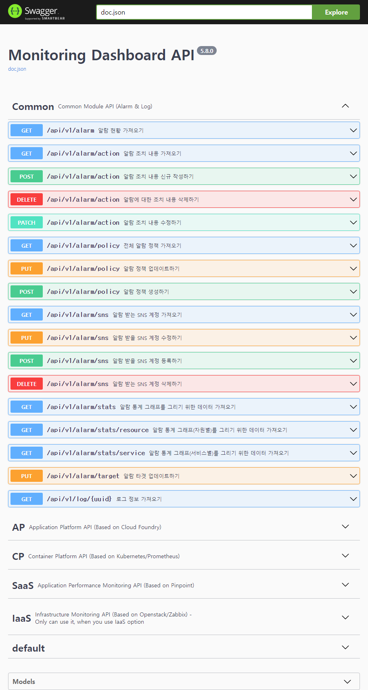

### [Index](https://github.com/PaaS-TA/Guide) > [User Guide](user_guide.md) > Monitoring API


# Monitoring API User Guide
1. [개요](#1)
2. [Monitoring API User Guide](#2)


## <div id="1">1. 개요
이 문서는 PaaS-TA Monitoring Dashboard 서비스 배포시 모니터링 서비스 플랫폼을 구성하는 컴포넌트들 중 Monitoring API 모듈 사용 가이드를 제공하기 위해 작성되었다.


## <div id="2">2. Monitoring API User Guide


### │ Swagger *(API Documentation)*
Monitoring API 모듈에는 Swagger 기반으로 작성된 API 가이드 문서가 포함되어 제공되고 있다. Swagger Web UI를 통해 API 문서를 확인할 수 있고 간단한 기능 테스트도 해볼 수 있다.

Swagger Web UI 접속을 위해서 Monitoring API 모듈이 동작하고 있는 'monitoring-api' 인스턴스(VM)의 주소를 확인한다. 주소 확인은 다음과 같이 할 수 있다.

```shell
$ bosh -d paasta-monitoring vms
Using environment '10.200.3.6' as client 'admin'

Task 8341. Done

Deployment 'paasta-monitoring'

Instance                                                    Process State  AZ  IPs           VM CID                                VM Type  Active  Stemcell
caas-monitoring-batch/f2941049-28b8-4254-bed3-4deb261da7b4  running        z1  10.200.3.139  9341b2ae-2911-49ce-9871-17ba686ef876  small    true    bosh-openstack-kvm-ubuntu-bionic-go_agent/1.97
iaas-monitoring-batch/a879fa3a-71fd-459c-8cc5-c0c2e7968ae5  running        z1  10.200.3.138  ec0824b1-984a-4a6b-a98c-d131d2a71265  small    true    bosh-openstack-kvm-ubuntu-bionic-go_agent/1.97
influxdb/1f4b88d9-d2d8-4939-a820-997524b0c0f8               running        z1  10.200.3.101  2f70a0b6-84c1-46f6-9f72-4d55b4018382  large    true    bosh-openstack-kvm-ubuntu-bionic-go_agent/1.97
mariadb/fce2df70-91da-462f-98dc-385406ab1b98                running        z1  10.200.3.102  23f3b8da-d258-47d1-8bf0-973225a95448  medium   true    bosh-openstack-kvm-ubuntu-bionic-go_agent/1.97
monitoring-api/4026e8bf-8146-4e82-b0d7-e19b08083fa0         running        z1  10.200.3.141  663693ff-d675-4ac7-9ce0-ead18685b2d7  small    true    bosh-openstack-kvm-ubuntu-bionic-go_agent/1.97
monitoring-batch/ab200afc-7f39-4eaf-8f41-efc61a258c16       running        z1  10.200.3.137  5ced3ea7-86a0-40e6-aac1-e06a17bdfc04  small    true    bosh-openstack-kvm-ubuntu-bionic-go_agent/1.97
monitoring-web/9d0053a4-4f38-4f15-8f1a-fc245c4886fe         running        z1  10.200.3.88   5e79af49-f8a3-44dd-a625-c2c04572e5ff  small    true    bosh-openstack-kvm-ubuntu-bionic-go_agent/1.97
redis/47ecc810-8126-4667-80a6-6ca06e0f5d90                  running        z1  10.200.3.103  af078d82-53a7-4721-a50c-2dbe6f40ff01  small    true    bosh-openstack-kvm-ubuntu-bionic-go_agent/1.97
saas-monitoring-batch/f23ccc1d-1b1d-42a8-8f7b-965a0471fede  running        z1  10.200.3.140  457dfdb8-6f87-4c7a-b4e5-17a782d26a10  small    true    bosh-openstack-kvm-ubuntu-bionic-go_agent/1.97
td-agent/3c269848-afe4-4b9e-adf8-4744da706a65               running        z1  10.200.3.100  f01cf1cf-542a-4cbd-a9f9-3a2ac7774ffe  small    true    bosh-openstack-kvm-ubuntu-bionic-go_agent/1.97

10 vms

Succeeded
```

인스턴스 주소가 확인되었다면 '***{IP_ADDRESS}:8395/swagger/index.html***' 경로를 통해 웹 브라우저에서 Swagger 기반으로 작성된 API 문서를 확인할 수 있다.





Swagger가 제공하는 기본 Web UI를 확인할 수 있으며 해당 인터페이스를 통해 API 가이드는 물론 간단한 동작 테스트도 제공 받을 수 있다. 


### [Index](https://github.com/PaaS-TA/Guide) > [User Guide](user_guide.md) > Monitoring API
