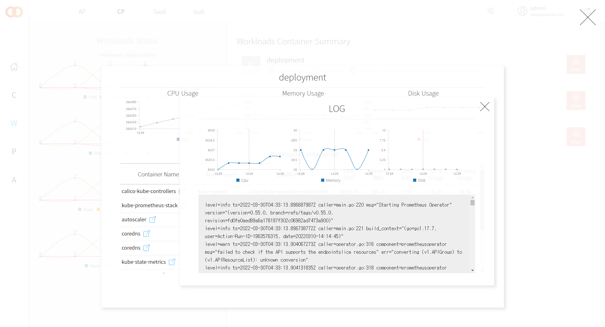

### [Index](https://github.com/PaaS-TA/Guide) > [User Guide](user_guide.md) > Monitoring Web

# Monitoring Web User Guide
1. [개요](#1)
2. [Monitoring Web User Guide](#2)

## 
1. 개요
이 문서는 Monitoring Web (Monitoring Dashboard) 의 각 화면과 상세 설명을 위한 사용 가이드를 제공하기 위해 작성되었다.

## 
2. Monitoring Web User Guide
### │ Login
최초 로그인 화면에서 PaaS/IaaS/CaaS 통합 회원 계정을 사용해 로그인한다.

### │ Register Member
PaaS/IaaS/CaaS 플랫폼에 대한 인증을 완료한 후 통합 회원 계정을 생성한다.

### │ Monitoring Dashboard Main
모니터링 대시보드(Monitoring Web) 메인 화면으로 각 서비스 플랫폼에 대한 모니터링 요약 정보를 확인할 수 있다.

### │ AP (PaaS) Main
AP (PaaS) 모니터링 메인 화면으로 각 시스템 대한 모니터링 요약 정보를 확인할 수 있다.

### │ AP (PaaS) > BOSH Main
BOSH 모니터링 메인 화면으로 BOSH VM에 대한 스테이터스 정보와 BOSH VM에서 실행중인 프로세스 요약 정보가 기본적으로 노출된다.

### │ AP (PaaS) > BOSH > Chart
BOSH 차트 모니터링 화면으로 BOSH VM에 대한 상세 메트릭 정보를 차트 형태로 확인할 수 있다.

### │ AP (PaaS) > BOSH > Log
BOSH 로그 모니터링 화면으로 BOSH VM에 대한 상세 로그 정보를 확인할 수 있다.

### │ AP (PaaS) > PaaS-TA Main
PaaS-TA 모니터링 메인 화면으로 PaaS-TA VM에 대한 스테이터스 정보와 각 PaaS-TA VM에서 실행중인 프로스세스 요약 정보가 기본적으로 노출된다.

### │ AP (PaaS) > PaaS-TA > Chart
PaaS-TA 차트 모니터링 화면으로 각 PaaS-TA VM에 대한 상세 메트릭 정보를 차트 형태로 확인할 수 있다.

### │ AP (PaaS) > PaaS-TA > Log
PaaS-TA 로그 모니터링 화면으로 각 PaaS-TA VM에 대한 상세 로그 정보를 확인할 수 있다.

### │ AP (PaaS) > Container Main
Container 모니터링 메인 화면으로 실행중인 컨테이너 및 Diego-Cell VM에 대한 스테이터스 정보와 Cell & Container Relationship 정보가 기본적으로 노출된다.

### │ AP (PaaS) > Container > Chart
Container 차트 모니터링 화면으로 실행중인 컨테이너(앱)에 대한 상세 메트릭 정보를 차트 형태로 확인할 수 있다.

### │ AP (PaaS) > Alarm > Policy
Alarm 정책 설정 화면으로 AP (PaaS) 환경에서 모니터링 되는 대상들에 대한 세부 알람 정책을 설정할 수 있다.

### │ AP (PaaS) > Alarm > Status
Alarm 현황 화면으로 AP (PaaS) 환경에서 모니터링 되는 대상들에 대한 세부 알람 현황을 확인할 수 있다.

### │ AP (PaaS) > Alarm > Statistics
Alarm 통계 화면으로 AP (PaaS) 환경에서 모니터링 되는 대상들에 대한 세부 알람 통계를 확인할 수 있다.

### │ CP (CaaS) Main
CP (CaaS) 모니터링 메인 화면으로 각 시스템 대한 모니터링 요약 정보를 확인할 수 있다.

### │ CP (CaaS) > Cluster Main
Cluster 모니터링 메인 화면으로 쿠버네티스 클러스터 대한 리소스 정보, 노드 및 스테이터스 정보와 메트릭 정보 등이 기본적으로 노출된다.

### │ CP (CaaS) > Cluster > Chart
Cluster 차트 모니터링 화면으로 쿠버네티스 클러스터의 각 노드에 대한 상세 메트릭 정보를 차트 형태로 확인할 수 있다.

### │ CP (CaaS) > Workloads Main
Workloads 모니터링 메인 화면으로 쿠버네티스 클러스터의 각 워크로드 대한 스테이터스 정보와 메트릭 정보 등이 기본적으로 노출된다.

### │ CP (CaaS) > Workloads > Chart
Workloads 차트 모니터링 화면으로 쿠버네티스 클러스터의 각 워크로드 대한 상세 메트릭 정보를 차트 형태로 확인할 수 있다.

### │ CP (CaaS) > Workloads > Chart > Log
Workloads 로그 모니터링 화면으로 쿠버네티스 클러스터의 각 워크로드에서 실행중인 컨테이너의 상세 로그 정보를 확인할 수 있다.

### │ CP (CaaS) > Pod Main
Pad 모니터링 메인 화면으로 쿠버네티스 클러스터에서 실행중인 각 Pod에 대한 스테이터스 정보와 메트릭 정보 등이 기본적을 노출된다.

### │ CP (CaaS) > Pod > Chart
Pad 차트 모니터링 화면으로 쿠버네티스 클러스터에서 실행중인 각 Pod에 대한 상세 메트릭 정보를 차트 형태로 확인할 수 있다.

### │ CP (CaaS) > Pod > Chart > Log
Pad 로그 모니터링 화면으로 쿠버네티스 클러스터에서 실행중인 각 Pod에 대한 상세 로그 정보를 확인할 수 있다.

### │ CP (CaaS) > Alarm > Policy
Alarm 정책 설정 화면으로 CP (CaaS) 환경에서 모니터링 되는 대상들에 대한 세부 알람 정책을 설정할 수 있다.

### │ CP (CaaS) > Alarm > Status
Alarm 현황 화면으로 CP (CaaS) 환경에서 모니터링 되는 대상들에 대한 세부 알람 현황을 확인할 수 있다.

### │ SaaS > Application Main
Application 모니터링 메인 화면으로 PaaS-TA (AP) 에 배포된 전체 애플리케이션 목록을 확인할 수 있다.

### │ SaaS > Alarm > Policy
Alarm 정책 설정 화면으로 SaaS 환경에서 모니터링 되는 대상들에 대한 세부 알람 정책을 설정할 수 있다.

### │ SaaS > Alarm > Status
Alarm 현황 화면으로 SaaS 환경에서 모니터링 되는 대상들에 대한 세부 알람 현황을 확인할 수 있다.

### │ IaaS Main
IaaS(OpenStack) 모니터링 메인 현황 화면으로 IaaS 리소스 사용량, 하이퍼바이저 노드 스테이터스 및 메트릭 정보, 프로젝트 정보 등이 요약되어 기본적으로 노출된다.

### │ IaaS > Hypervisor Main
Hypervisor 모니터링 메인 화면으로 각 노드의 스테이터스 정보와 메트릭 정보 등이 기본적으로 노출된다.

### │ IaaS > Hypervisor > Chart
Hypervisor 차트 모니터링 화면으로 각 노드의 상세 메트릭 정보를 차트 형태로 확인할 수 있다.

### │ IaaS > Project Main
Project 모니터링 메인 화면으로 전체 (OpenStack) 프로젝트 목록과 각 프로젝트 그룹에 속한 VM 정보 등이 기본적으로 노출된다.

### │ IaaS > Project > Instance List > Chart
Instance 차트 모니터링 화면으로 각 VM에 대한 상세 메트릭 정보를 차트 형태로 확인할 수 있다.

### │ IaaS > Alarm > Policy
Alarm 정책 설정 화면으로 IaaS 환경에서 모니터링 되는 대상들에 대한 세부 알람 정책을 설정할 수 있다.

### │ IaaS > Alarm > Status
Alarm 현황 화면으로 IaaS 환경에서 모니터링 되는 대상들에 대한 세부 알람 현황을 확인할 수 있다.

### │ IaaS > Alarm > Statistics
Alarm 통계 화면으로 IaaS 환경에서 모니터링 되는 대상들에 대한 세부 알람 통계를 확인할 수 있다.

### [Index](https://github.com/PaaS-TA/Guide) > [User Guide](user_guide.md) > Monitoring Web
